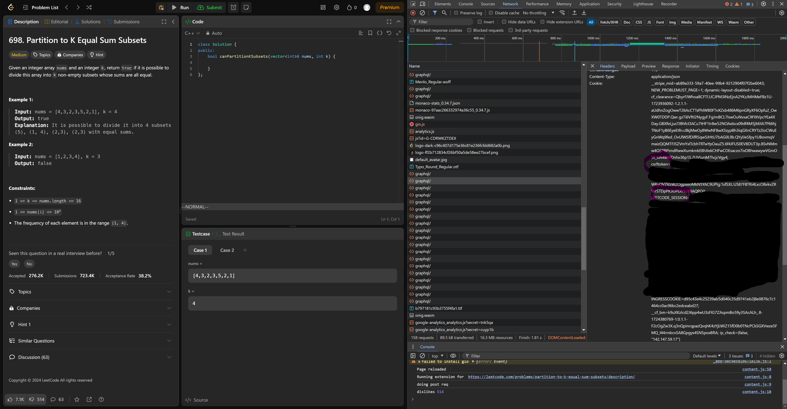

# LeetcodeExtract
A Node.js project that extracts Leetcode submissions and pushes them to a repository. See an [example repository](https://github.com/bsheth711/LeetcodeSolutions).

# Requirements
- Node.js 20+
- Bash

# How To Setup
1. Get Leetcode tokens from your Leetcode cookie.  
The easiest way to do this is by opening your browser's inspect mode and loading a page while signed into Leetcode. Then, switch to the network tab and choose a request that is being sent to Leetcode, such as a graphql request. In the headers for the request Headers section, you will find a Cookie containing your "LEETCODE_SESSION" and "csrftoken". Do not share these tokens with anybody.

2. Save tokens in a json file.  
Save the tokens in a in a json file with the following format:
```
{
	"LEETCODE_SESSION": "...",
	"csrftoken": "..."
}
```

3. Set the environment variable LEETCODE_CREDENTIALS_PATH to the path to the file.  

Note: Occasionally you will need to get fresh tokens and replace the ones in your tokens file.
# How To Run
Run the following command from your Bash terminal:
```
./src/run.sh
```

# TODO
- How To Setup Section
- Migrate to Typescript?